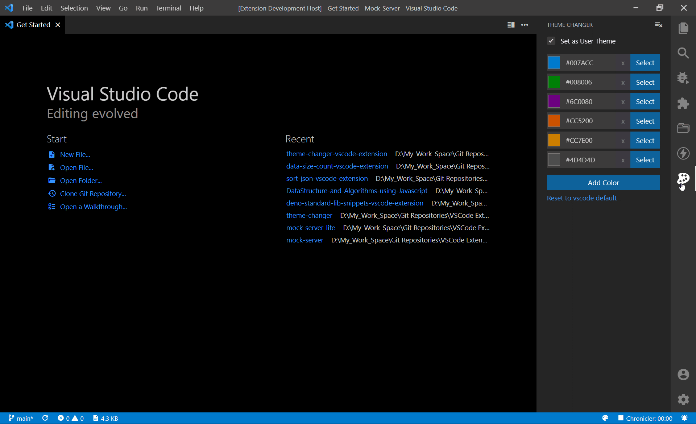

# Theme Changer

This extensions helps to save your favorite Theme color and generates the `workbench.colorCustomizations` colors from the selected theme color. All generated theme colors will be in the selected theme color shade.



## Features

- Add your favorite theme color
- Generate vscode theme colors for both user and workspace settings
- Sidebar webview view is available
- Click on the color pallet icon on the status bar to set the vscode to next favorite theme color
- Fully customizable

## Extension Settings

This extension contributes the following settings:

- `theme-changer.settings.setAsUserTheme` - Set to true to update the theme color in user settings else it sets to the workspace folder settings.
- `theme-changer.settings.theme:'Default Dark+'`: Provide theme name to generate the Theme Colors, Leave it empty to generate as a global theme
- `theme-changer.settings.colors: [ "#007ACC", "#008006", "#6C0080", "#CC5200", "#CC7E00", "#4D4D4D" ]`: add your favorite theme colors here.
- `theme-changer.settings.colorRangeCustomizations` - Set vsCode style attributes and its color lightness from 0 to 100. give + or - to increment or decrement the current color lightness.
- `theme-changer.settings.overrideDefaultColorRange` - Set to true if you want to override the default Color Range Customizations

Default colorRangeCustomizations :

```json
{
  "activityBar.activeBackground": "15",
  "activityBar.activeBorder": "50",
  "activityBar.background": "5",
  "activityBar.dropBorder": "50",
  "activityBarBadge.background": "",
  "badge.background": "",
  "breadcrumb.activeSelectionForeground": "60",
  "breadcrumb.focusForeground": "60",
  "button.background": "",
  "button.hoverBackground": "+10",
  "editor.background": "0",
  "editor.findMatchBackground": "40",
  "editor.findMatchHighlightBackground": "25",
  "editor.inactiveSelectionBackground": "20",
  "editor.lineHighlightBackground": "15",
  "editor.selectionBackground": "20",
  "editor.selectionHighlightBackground": "20",
  "editor.selectionHighlightBorder": "50",
  "editorBracketMatch.border": "50",
  "editorCursor.foreground": "60",
  "editorGroup.dropBackground": "10",
  "editorGroupHeader.tabsBackground": "10",
  "editorIndentGuide.background": "10",
  "editorLineNumber.activeForeground": "70",
  "editorLink.activeForeground": "70",
  "notificationLink.foreground": "",
  "focusBorder": "30",
  "list.activeSelectionBackground": "20",
  "list.highlightForeground": "",
  "list.hoverBackground": "15",
  "list.inactiveSelectionBackground": "15",
  "menu.background": "10",
  "menu.selectionBackground": "30",
  "merge.currentContentBackground": "15",
  "merge.currentHeaderBackground": "30",
  "panelTitle.activeForeground": "60",
  "progressBar.background": "",
  "scrollbarSlider.activeBackground": "",
  "scrollbarSlider.background": "20",
  "scrollbarSlider.hoverBackground": "30",
  "searchEditor.findMatchBackground": "25",
  "selection.background": "20",
  "settings.focusedRowBackground": "5",
  "settings.focusedRowBorder": "20",
  "settings.modifiedItemIndicator": "",
  "settings.rowHoverBackground": "5",
  "sideBar.background": "5",
  "sideBar.border": "0",
  "sideBarTitle.foreground": "60",
  "statusBar.background": "",
  "statusBar.noFolderBackground": "",
  "symbolIcon.arrayForeground": "",
  "symbolIcon.constructorForeground": "70",
  "symbolIcon.functionForeground": "70",
  "symbolIcon.methodForeground": "",
  "symbolIcon.moduleForeground": "",
  "symbolIcon.variableForeground": "60",
  "tab.activeBackground": "20",
  "tab.activeBorder": "50",
  "tab.activeModifiedBorder": "50",
  "tab.border": "20",
  "tab.hoverBackground": "15",
  "tab.inactiveBackground": "10",
  "tab.inactiveModifiedBorder": "",
  "terminal.foreground": "60",
  "terminal.selectionBackground": "20",
  "terminalCursor.foreground": "",
  "textLink.foreground": "50",
  "textLink.activeForeground": "65",
  "titleBar.activeBackground": "15",
  "toolbar.hoverBackground": "0",
  "window.activeBorder": "30"
}
```

You can adjust the lightness to get the darker and lighter shade of the Theme color from the settings `theme-changer.settings.colorRangeCustomizations`

- You can adjust the lightness from `0` to `100` to get the shades.
- `'+10'` or `'-10'` - Helps to increment or decrement the lightness by `10%` from the selected Theme Color.
- Incrementing value will gives you the lighter shade and Decrementing value will gives you the darked shade of the selected color.
- `'50'` - You can also directly set the lightness without incrementing or decrementing the selected color.
- `'0'` - give you the black color.
- `'100'` gives you the white color.
- `''` - leaving it empty will use the actual lightness of the selected color.

**Enjoy!**
